<div align="center">



</div>

<br/>

<div align="center">



</div>

---

<details>
<summary><kbd>📁 about_me.yml</kbd> — expand</summary>

<br/>

```yaml
# /home/unai/profile.yml

identity:
  name:       "Unai Benito Sánchez"
  role:       "Software Developer — Full Stack"
  focus:
    - Web Development
    - Cross-Platform Application Development
  location:   "Spain 🇪🇸"

mindset:
  principle:  "If it runs more than twice, automate it."
  obsessed_with:
    - Clean architecture
    - Modern tooling
    - UX that doesn't hurt people
  fun_fact:   "I have written Brainfuck. Voluntarily."

contact:
  email:      "unaibenitos@gmail.com"
  linkedin:   "unai-benito-sánchez"
  portfolio:  "portfolio-unai-benito-sanchez.vercel.app"
```

</details>

---

## `> ls -la stack/`

<table>
  <tr>
    <td valign="top" width="50%">

### 🖥️ &nbsp;Frontend


### ⚙️ &nbsp;Backend


  </td>
  <td valign="top" width="50%">

### 📱 &nbsp;Mobile & Cross-Platform


### 🗄️ &nbsp;Databases


### 🔀 &nbsp;Version Control


### ☁️ &nbsp;DevOps & Cloud


  </td>
  </tr>
</table>

---

## `> git log --oneline --graph --featured`

<p align="center">
  <a href="https://github.com/UnaiBenitoSanchez/TFG_UnaiBenito_FactoryManagement">
    
  </a>
  <a href="https://github.com/UnaiBenitoSanchez/AIDungeonMaster_2-DAM_TFG">
    
  </a>
</p>

---

## `> htop --github`

<p align="center">
  
</p>

<p align="center">
  
  
</p>

---

## `> open --connect`

<p align="center">
  <a href="https://www.linkedin.com/in/unai-benito-s%C3%A1nchez-91a1042ab" target="_blank">
    
  </a> 
  &nbsp;
  <a href="mailto:unaibenitos@gmail.com">
    
  </a>
  &nbsp;
  <a href="https://portfolio-unai-benito-sanchez.vercel.app/" target="_blank">
    
  </a>
</p>

---

<div align="center">

<sub><code>© Unai Benito Sánchez</code></sub>
</div>
